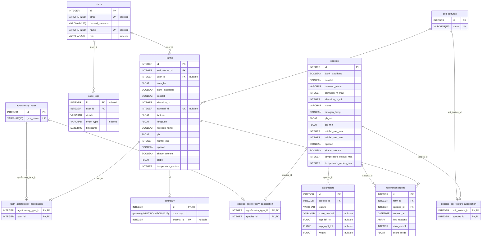

# Entity Relationship Diagram

```mermaid
erDiagram
  agroforestry_types {
    INTEGER id PK
    VARCHAR(15) type_name UK
  }

  audit_logs {
    INTEGER id PK "indexed"
    INTEGER user_id FK
    VARCHAR details
    VARCHAR event_type "indexed"
    DATETIME timestamp
  }

  boundary {
    INTEGER id PK,FK
    geometry(MULTIPOLYGON-4326) boundary
    INTEGER external_id UK "nullable"
  }

  farm_agroforestry_association {
    INTEGER agroforestry_type_id PK,FK
    INTEGER farm_id PK,FK
  }

  farms {
    INTEGER id PK
    INTEGER soil_texture_id FK
    INTEGER user_id FK "nullable"
    FLOAT area_ha
    BOOLEAN bank_stabilising
    BOOLEAN coastal
    INTEGER elevation_m
    INTEGER external_id UK "nullable"
    FLOAT latitude
    FLOAT longitude
    BOOLEAN nitrogen_fixing
    FLOAT ph
    INTEGER rainfall_mm
    BOOLEAN riparian
    BOOLEAN shade_tolerant
    FLOAT slope
    INTEGER temperature_celsius
  }

  parameters {
    INTEGER id PK
    INTEGER species_id FK
    VARCHAR feature
    VARCHAR score_method "nullable"
    FLOAT trap_left_tol "nullable"
    FLOAT trap_right_tol "nullable"
    FLOAT weight "nullable"
  }

  recommendations {
    INTEGER id PK
    INTEGER farm_id FK
    INTEGER species_id FK
    DATETIME created_at
    ARRAY key_reasons
    INTEGER rank_overall
    FLOAT score_mcda
  }

  soil_textures {
    INTEGER id PK
    VARCHAR(15) name UK
  }

  species {
    INTEGER id PK
    BOOLEAN bank_stabilising
    BOOLEAN coastal
    VARCHAR common_name
    INTEGER elevation_m_max
    INTEGER elevation_m_min
    VARCHAR name
    BOOLEAN nitrogen_fixing
    FLOAT ph_max
    FLOAT ph_min
    INTEGER rainfall_mm_max
    INTEGER rainfall_mm_min
    BOOLEAN riparian
    BOOLEAN shade_tolerant
    INTEGER temperature_celsius_max
    INTEGER temperature_celsius_min
  }

  species_agroforestry_association {
    INTEGER agroforestry_type_id PK,FK
    INTEGER species_id PK,FK
  }

  species_soil_texture_association {
    INTEGER soil_texture_id PK,FK
    INTEGER species_id PK,FK
  }

  users {
    INTEGER id PK
    VARCHAR(255) email UK "indexed"
    VARCHAR(255) hashed_password
    VARCHAR(255) name UK "indexed"
    VARCHAR(50) role "indexed"
  }

  users ||--o{ audit_logs : user_id
  farms ||--o| boundary : id
  farms ||--o| farm_agroforestry_association : farm_id
  agroforestry_types ||--o| farm_agroforestry_association : agroforestry_type_id
  soil_textures ||--o{ farms : soil_texture_id
  users ||--o{ farms : user_id
  species ||--o{ parameters : species_id
  farms ||--o{ recommendations : farm_id
  species ||--o{ recommendations : species_id
  species ||--o| species_agroforestry_association : species_id
  agroforestry_types ||--o| species_agroforestry_association : agroforestry_type_id
  species ||--o| species_soil_texture_association : species_id
  soil_textures ||--o| species_soil_texture_association : soil_texture_id
```
