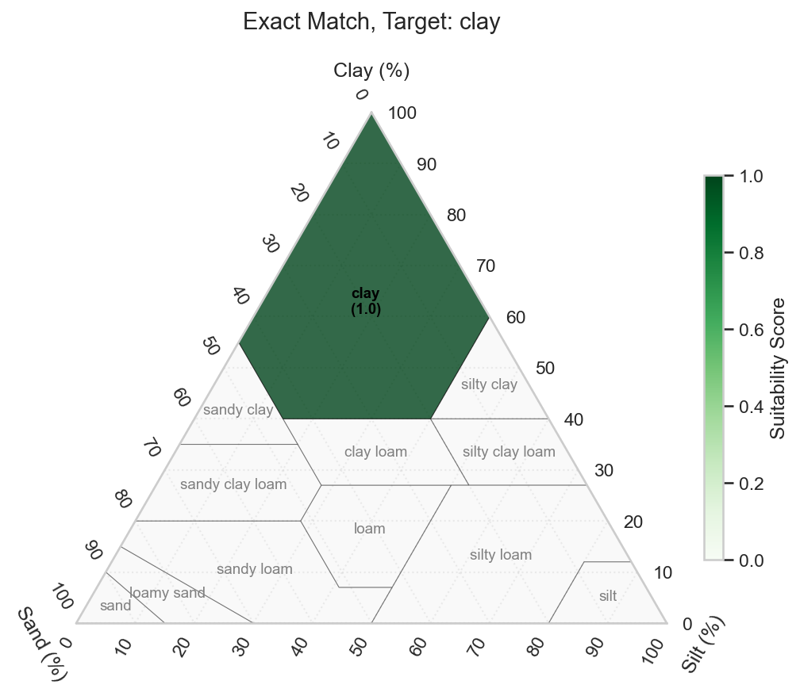
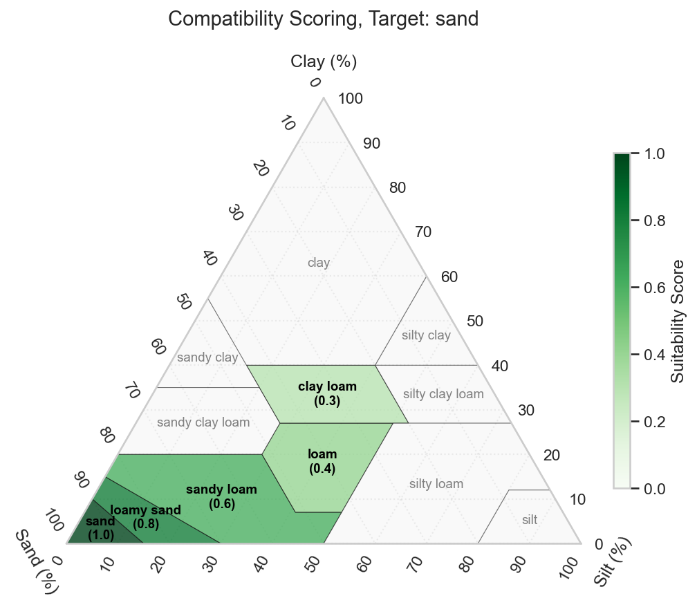

# Suitability Scoring

## Introduction
This document outlines the scoring algorithm used to assess the suitability of a specific tree species for a given farm profile. The system compares farm features (e.g., rainfall, soil type) against the biological requirements of a species to generate a suitability score between 0.0 (Unsuitable) and 1.0 (Highly Suitable).

The core calculation utilises a Weighted Arithmetic Mean. This ensures that critical factors (like rainfall) can influence the final score more heavily than less critical factors, provided they are weighted accordingly in the configuration.

This scoring allows for species-specific parameter overrides and generates detailed textual explanations for every scoring decision.

## The two-stage filter process
For efficiency a two-stage "funnel" approach is utilised:

1.  **Hard exclusion:** This is a binary pass. Trees are either "in" or "out" based on hard constraints. This prevents wasting resources scoring trees that are fundamentally impossible for that location (e.g., wrong agroforestry use). Only these "valid" species are passed to the scoring engine. If the exclusion function returns IDs not present in species data, they are logged as "unknown species" in the explanations output but skipped for scoring.

2.  **Soft scoring (the MCDA loop):** Trees that survive the exclusion are then grade using a weighted Multi-Criteria Decision Analysis (MCDA) scoring on a curve (0.0 to 1.0) based on how *well* they fit, not just *if* they fit. Total scoring is performed using a weighted arithmetic mean of individual feature scores. Feature behaviour is defined in configuration file and applied as follows:
    * **Numerical features:** Evaluated using range logic (e.g., `num_range`). A score of 1.0 is awarded if the farm's value falls between the species' min/max requirements. Zero scores are assigned for values outside this range or missing data.

    * **Categorical features:** Evaluated using preference matching (e.g., `cat_exact`). Checks if the farm's attribute (e.g., soil texture) exists within the species' list of preferred types. A score of 1.0 is returned is an exact match is found and zero if no match is found.


## 1. The aggregation algorithm

The final suitability score for a species is calculated by aggregating individual feature scores.

$`\text{Total Score} = \frac{\sum (Weight_i \times Score_i)}{\sum Weight_i}`$

where:

* $`Score_i`$: The calculated score (0.0 to 1.0) for a specific feature (e.g., Soil pH).
* $`Weight_i`$: The importance weight assigned to that feature.

**Handling Missing Data:**
If data for a specific feature is missing (either from the farm input or the species database), that feature is **excluded** from the calculation entirely. It contributes neither to the numerator nor the denominator. This prevents missing data from artificially lowering the score and provides the denominator remains greater than zero.


## 2. Numerical scoring methods

Numeric features (such as temperature, rainfall, or pH) are scored using one of two methods: **Range** or **Trapezoid**.

### A. Range scoring (`num_range`)

This is a strict binary method. It defines a hard acceptance window.


* **Logic:** If the farm value falls between the species' minimum and maximum requirements, it receives a score of 1.0. Otherwise, it receives 0.0.
* **Use Case:** Best for absolute biological limits where survival is impossible outside specific bounds.

### B. Trapezoid Scoring (`trapezoid`)

This method utilizes fuzzy logic to represent "optimal" versus "tolerable" ranges. It accounts for the fact that a tree might survive—but not thrive—at the edges of its environmental tolerance.


The shape is defined by four points derived from the species data:

1. **Left Shoulder (a to b):** The score ramps up linearly from 0.0 to 1.0. This represents the range where the species is stressed but surviving.
2. **Plateau (b to c):** The score is exactly 1.0. This is the optimal range for the species.
3. **Right Shoulder (c to d):** The score ramps down linearly from 1.0 to 0.0. This represents the range where the species is stressed but surviving.
4. **Outside:** Any value below or above  receives a score of 0.0.

**Note:** If the tolerances are wide enough to overlap, the system collapses the plateau to a single midpoint to ensure the geometry remains valid ($`a \le b \le c \le d`$).


## 3. Categorical Scoring Methods

Categorical features (such as soil texture) are scored using **Exact** or **Compatibility** matching.

### A. Exact Matching (`cat_exact`)

This method checks for direct membership in a preferred list.



* **Logic:** If the farm's attribute (e.g., "clay") exists within the species' list of preferred types, the score is 1.0. If not, the score is 0.0.
* **Use Case:** Best for binary constraints where no substitute is acceptable.

### B. Compatibility Scoring (`cat_compatibility`)

This method allows for partial matches using a pre-defined compatibility matrix.



* **Logic:**
  * If the farm value is in the preferred list (Exact Match), the score is 1.0.
  * If the farm value is *not* in the list, the system checks the compatibility matrix to see if the farm's value is an acceptable substitute for a preferred value.
* **Example:** A species prefers "sand". The farm has "sandy loam". If the matrix defines the similarity between sand and sandy loam as 0.6, the score is 0.6.

* **Use Case:** Essential for soil textures where boundaries between types are fluid.


## 4. Traceability and Explanations
In addition to the raw scores, the function generates a `explanations` dictionary.

For every feature evaluated, the system records:

* **Raw Data:** The input value from the farm and the requirement from the species.
* **Score:** The specific contribution of that feature (0.0–1.0).
* **Reason:** A human-readable string explaining the result (e.g., *"within left shoulder [500, 600]"* or *"closest compatibility match 'Clay' at 0.50"*) and any missing data warnings.


## 5. Configuration
The scoring module uses a two-tier configuration strategy to balance ease of use with biological accuracy:

1.  **Global Configuration (`config/recommend.yaml`):** Defines the "Baseline." This file lists every available feature (e.g., rainfall, pH), the default scoring algorithm (e.g., numerical range vs. categorical match), and a default weight.

2.  **Species-Specific Overrides (`species_params`):** Defines the "Exceptions." This table contains specific instructions for tree species that deviate from the defaults.

The system applies a cascade logic: For a given tree and feature, use the values in `species_params`. If no entry exists (or the value is empty), fall back to the defaults in `config/recommend.yaml`.

### The global configuration file `recommend.yaml`
This file contains the global default values. An example is shown below.
```yaml
# Enable/disable exclusion rules
enable_exclusions: True

# Names for id columns
ids:
  farm: id
  species: id

names:
  species_common_name: species_common_name
  species_name: species_name

# Configuration for features
features:
  # Numeric features
  rainfall_mm:
    type: numeric
    short: rainfall
    score_method: num_range
    default_weight: 0.20

  temperature_celsius:
    type: numeric
    short: temperature
    score_method: num_range
    default_weight: 0.20

  elevation_m:
    type: numeric
    short: elevation
    score_method: trapezoid
    tolerance: # for trapezoid scoring
      left:  100 # Left shoulder width
      right: 200 # Right shoulder width    
    default_weight: 0.20

  ph:
    type: numeric
    short: ph
    score_method: num_range
    default_weight: 0.20

  # Categorical features
  soil_texture:
    type: categorical
    short: soil
    default_weight: 0.20
    compatibility_pairs: 
      sand: 
        sand: 1.0
        loam: 0.4
        silt: 0.1
        clay: 0.0
      loam: 
        sand: 0.4
        loam: 1.0
        silt: 0.6
        clay: 0.3
      silt:
        sand: 0.1
        loam: 0.6
        silt: 1.0
        clay: 0.3
      clay:
        sand: 0.0
        loam: 0.3
        silt: 0.3
        clay: 1.0
```

### The `species_params` table

This table allows the fine-tuning of the decision model. For example, while `rainfall` might have a default weight of `0.2`, a drought-sensitive species might require a weight of `0.40` to ensure it is never recommended in dry areas. Initial values have been ingested into the database and these cannot be changed. Future work should consider allowing a supervisor to modify and add parameters. 

  * **Scope:** You only need to list rows for species/features that require *custom* handling. You do not need to list every species for every feature.

#### **Schema Definition**

| Column Name | Data Type | Required | Description |
| :--- | :--- | :--- | :--- |
| **`species_id`** | Integer | Yes | The unique identifier for the species. This must exactly match the ID used in the species profile database. |
| **`feature`** | String | Yes | The key of the feature being configured. This must match a key defined under `features:` in the global `recommend.yaml` (e.g., `rainfall_mm`, `soil_texture`). |
| **`score_method`** | String | No | The scoring algorithm to use (e.g., `num_range`, `trapezoid`, `cat_exact`, `cat_compatibility`). <br>**Behaviour if empty:** Inherits the `score_method` from `recommend.yaml`. |
| **`weight`** | Float (0.0 - 1.0) | No | The relative importance of this feature for this specific tree. <br>**Behaviour:** A higher value makes this feature more dominant in the final score. A value of `0` effectively ignores this feature for this species. A missing value will inherit the default weight from `recommend.yaml` |
| **`trap_left_tol`** | Float (0.0 - 5000.0) | No | The width of the left shoulder of the trapezoid. <br>**Behaviour:** A higher value will reduce the plateau width. A value of `0` removes the left shoulders. A missing value will inherit the default tolerance from `recommend.yaml` |
| **`trap_right_tol`** | Float (0.0 - 5000.0) | No | The width of the right shoulder of the trapezoid. <br>**Behaviour:** A higher value will reduce the plateau width. A value of `0` removes the left shoulders. A missing value will inherit the default tolerance from `recommend.yaml` |


#### **Example species parameter definitions**

Below is an example.

  * **Species 1** is highly sensitive to climate (`rainfall` weight increased to 0.3) but indifferent to `elevation` (weight lowered to 0.05). Will be scored using the num_range method. The soil_texture will be scored with the default scorer with a eight of 0.2.
  * **Species 2** prioritises `rainfall` above all else (weight 0.5).
  * **Species 4** Is using the trapezoid scorer with a eight of 0.25. The left and right shoulder widths are 200 m and 500 m respectively.

```csv
species_id,feature,score_method,weight
1,rainfall_mm,num_range,0.3
1,temperature_celsius,num_range,0.25
1,ph,num_range,0.2
1,elevation_m,num_range,0.05
1,soil_texture,,0.2
2,rainfall_mm,num_range,0.5
2,temperature_celsius,num_range,0.1
2,ph,num_range,0.2
4,elevation_m,trapezoid,0.25,200,500
```

#### Best Practices

1.  **Handling Missing Methods:** In the example above, `species_id: 1` has an empty `score_method` for `soil_texture`. The system will automatically look up `soil_texture` in `recommend.yaml` and use the method defined there (e.g., `cat_exact`). This keeps the override file clean.

2.  **Weight Normalisation:** While the scoring code automatically normalises weights (calculating the weighted average), it is best practice to try and keep the sum of weights for a specific `species_id` close to 1.0. This makes it easier for humans to understand the relative priority of traits.

3.  **Data Validation:** Ensure that every `feature` listed in this file exists in the `recommend.yaml`. If a feature is misspelled here, it will be ignored by the code, meaning the global default will be used unintentionally.