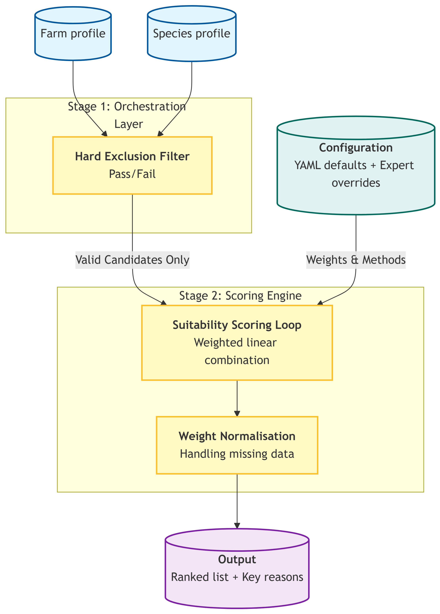

# Suitability Scoring

## Introduction
The recommendation of which trees are suitable for planting on various depends on a suitability assessment to score specific tree species against farm profiles. This document describes the implemented suitability assessment process.

The scoring iterates through every requested farm. For each farm, it retrieves a shortlist of candidate species and evaluates them feature-by-feature. This iterative approach allows for species-specific parameter overrides and generates detailed textual explanations for every scoring decision.

## The two-stage filter process
For efficiency a two-stage "funnel" approach is utilised:

1.  **Hard exclusion:** This is a binary pass. Trees are either "in" or "out" based on hard constraints. This prevents wasting resources scoring trees that are fundamentally impossible for that location (e.g., wrong agroforestry use). Only these "valid" species are passed to the scoring engine. If the exclusion function returns IDs not present in species data, they are logged as "unknown species" in the explanations output but skipped for scoring.

2.  **Soft scoring (the MCDA loop):** Trees that survive the exclusion are then grade using a weighted Multi-Criteria Decision Analysis (MCDA) scoring on a curve (0.0 to 1.0) based on how *well* they fit, not just *if* they fit. Total scoring is performed using a weighted arithmetic mean of individual feature scores. Feature behaviour is defined in configuration file and applied as follows:
    * **Numerical features:** Evaluated using range logic (e.g., `num_range`). A score of 1.0 is awarded if the farm's value falls between the species' min/max requirements. Zero scores are assigned for values outside this range or missing data.

    * **Categorical features:** Evaluated using preference matching (e.g., `cat_exact`). Checks if the farm's attribute (e.g., soil texture) exists within the species' list of preferred types. A score of 1.0 is returned is an exact match is found and zero if no match is found.



## Handling "Unknown" IDs
A specific edge case is handled where the exclusion function function might return a Species ID that exists in the logic but is missing from the species reference data.

  * **Behaviour:** The scoring function does not crash.
  * **Result:** It calculates no score but appends a specific note to the `explanations` dictionary.
  * **Use Case:** This is essential for data integrity debugging, allowing the spotting of when the reference database(Species profiles vs. Exclusion logic) are out of sync.

## Weight normalisation logic
The final score calculation handles missing data dynamically:

$`\text{Total Score} = \frac{\sum (\text{weight} \times \text{feature\_score})}{\sum \text{active\_weights}}`$

If a feature is missing data (score is `None`) or has a weight of 0, it is excluded from both the numerator and the denominator. This ensures that a tree isn't penalized simply because a specific, non-critical data point is missing, provided the denominator remains greater than zero.

## Traceability and Explanations
In addition to the raw scores, the function generates a `explanations` dictionary. This structure maps every farm-species pair to a breakdown of how each feature contributed to the final score, including the raw values used, the specific scoring rule triggered (e.g., "below minimum", "exact match"), and any missing data warnings.

## Configuration overview
The scoring module uses a two-tier configuration strategy to balance ease of use with biological accuracy:

1.  **Global Configuration (`recommend.yaml`):** Defines the "Baseline." This file lists every available feature (e.g., rainfall, pH), the default scoring algorithm (e.g., numerical range vs. categorical match), and a default weight.

2.  **Species-Specific Overrides (`species_params`):** Defines the "Exceptions." This tabular file (CSV or Excel) contains specific instructions for tree species that deviate from the defaults.

The system applies a cascade logic: For a given tree and feature, use the values in `species_params`. If no entry exists (or the value is empty), fall back to the defaults in `recommend.yaml`.

### The global configurationb file `recommend.yaml`
This file contains the global default values.
```yaml
# Names for id columns
ids:
  farm: farm_id
  species: species_id

names:
  species_common_name: species_common_name
  species_name: species_name

# Configuration for features
features:
  # Numeric features
  rainfall_mm:
    type: numeric
    short: rainfall
    score_method: num_range
    default_weight: 0.20

  temperature_celsius:
    type: numeric
    short: temperature
    score_method: num_range
    default_weight: 0.20

  elevation_m:
    type: numeric
    short: elevation
    score_method: num_range
    default_weight: 0.20

  ph:
    type: numeric
    short: ph
    score_method: num_range
    default_weight: 0.20

  # Categorical features
  soil_texture:
    type: categorical
    short: soil
    score_method: cat_exact
    categorical:
      exact_match: 1.0
    default_weight: 0.20
```

### The `species_params` file

This file allows the fine-tuning of the decision model. For example, while `rainfall` might have a default weight of `0.2`, a drought-sensitive species might require a weight of `0.40` to ensure it is never recommended in dry areas.

#### **File Format**

  * **Format:** CSV (`.csv`) or Excel (`.xlsx`).
  * **Scope:** You only need to list rows for species/features that require *custom* handling. You do not need to list every species for every feature.

#### **Schema Definition**

The file must contain the following four columns:

| Column Name | Data Type | Required | Description |
| :--- | :--- | :--- | :--- |
| **`species_id`** | Integer | Yes | The unique identifier for the species. This must exactly match the ID used in the species profile database. |
| **`feature`** | String | Yes | The key of the feature being configured. This must match a key defined under `features:` in the global `recommend.yaml` (e.g., `rainfall_mm`, `soil_texture`). |
| **`score_method`** | String | No | The scoring algorithm to use (e.g., `num_range`, `cat_exact`). <br>**Behavior if Empty:** Inherits the `score_method` from `recommend.yaml`. |
| **`weight`** | Float (0.0 - 1.0) | No | The relative importance of this feature for this specific tree. <br>**Behavior:** A higher value makes this feature more dominant in the final score. A value of `0` effectively ignores this feature for this species. A missing value will inherit the default weight from `recommend.yaml` |

#### **Example Data**

Below is an example.

  * **Species 1** is highly sensitive to climate (`rainfall` weight increased to 0.3) but indifferent to `elevation` (weight lowered to 0.05).
  * **Species 2** prioritizes `rainfall` above all else (weight 0.5).

```csv
species_id,feature,score_method,weight
1,rainfall_mm,num_range,0.3
1,temperature_celsius,num_range,0.25
1,ph,num_range,0.2
1,elevation_m,num_range,0.05
1,soil_texture,,0.2
2,rainfall_mm,num_range,0.5
2,temperature_celsius,num_range,0.1
2,ph,num_range,0.2
```

#### Best Practices

1.  **Handling Missing Methods:** In the example above, `species_id: 1` has an empty `score_method` for `soil_texture`. The system will automatically look up `soil_texture` in `recommend.yaml` and use the method defined there (e.g., `cat_exact`). This keeps the override file clean.

2.  **Weight Normalisation:** While the scoring code automatically normalises weights (calculating the weighted average), it is best practice to try and keep the sum of weights for a specific `species_id` close to 1.0. This makes it easier for humans to understand the relative priority of traits.

3.  **Data Validation:** Ensure that every `feature` listed in this file exists in the `recommend.yaml`. If a feature is misspelled here, it will be ignored by the code, meaning the global default will be used unintentionally.